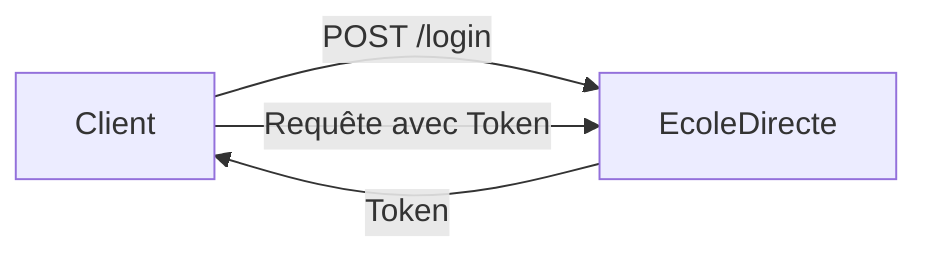

# 📘 Introduction

Bienvenue sur la documentation communautaire (non-officielle et non-affiliée) de l'API **EcoleDirecte**. Cette ressource centralise les connaissances nécessaires pour interagir avec la plateforme EcoleDirecte : consultation des notes, de l'emploi du temps, des devoirs, messagerie, et bien plus encore.

:::info Collaboration
Si vous repérez une erreur ou une information manquante, n'hésitez pas à [collaborer avec nous](/collaboration) !
:::

## 🚀 Base de l'API

L'URL de base pour toutes les requêtes est :
`https://api.ecoledirecte.com/v3`

La version documentée ici est la **v4.97.0**. Bien que des versions plus récentes puissent exister, les changements structurels majeurs sont rares. Cette documentation reste valide tant que la version v4.97.0 est supportée.

## 🛡️ User-Agent & Headers

L'utilisation d'un **User-Agent** valide est obligatoire pour chaque requête. Sans cela, EcoleDirecte bloquera vos appels API. Il est obligatoire d'utiliser le même User-Agent tout au long de votre session.

**Exemple de User-Agent recommandé :**
```
Mozilla/5.0 (Windows NT 10.0; Win64; x64) AppleWebKit/537.36 (KHTML, like Gecko) Chrome/122.0.0.0 Safari/537.36
```

## 📦 Format des requêtes

Toutes les requêtes (sauf les requêtes de login) prennent le header `X-Token` avec le token obtenu après un login réussi. Attention : ce n'est pas le même que celui utilisé dans la 2FA !
Les requêtes doivent être envoyés en `application/x-www-form-urlencoded`. Le body est presque tout le temps un seul paramètre `data` contenant un JSON.

## 📊 Format des réponses

L'API EcoleDirecte utilise un format de réponse JSON standardisé pour tous ses endpoints :

```json
{
  "host": "HTTP100",  // Identifiant du serveur ayant traité la requête
  "code": 200,        // Code de statut (200 = Succès, autres = Erreur)
  "token": "token",   // Nouveau token d'authentification (si renouvelé)
  "message": "",      // Message d'erreur (vide si succès)
  "data": {}          // Données utiles de la réponse
}
```

:::note
Dans le reste de cette documentation, le terme **"réponse"** fait référence au contenu de l'objet `data`.
:::

## 🚦 Premiers pas

La première étape pour utiliser l'API est l'authentification. Rendez-vous sur la page [Connexion](/docs/category/-connexion) pour apprendre à obtenir votre premier token d'accès.



:::tip Recherche Rapide
Utilisez la barre de recherche ( `Ctrl + K` ) pour trouver facilement un fichier.
:::
